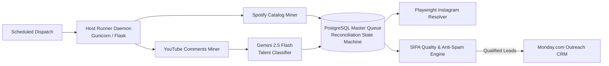

# BeatMatch AI Automation Hub

[](https://github.com/jraphaelcunha/beatmatch-ai-automation-hub/actions/workflows/ci.yml)
[](https://github.com/jraphaelcunha/beatmatch-ai-automation-hub)
[](tests/)
[](pyproject.toml)
[](LICENSE)
[](src/models/schemas.py)

> Autonomous talent discovery, verification, and qualification pipeline engineered for music producers, beatmakers, and audio engineering studios. Converts unstructured social signals into qualified, enriched prospective clients for track production, custom instrumental licensing, and mixing/mastering services.

---

## Overview

Music producers and audio engineering studios spend hours manually searching social platforms for vocalists and indie artists, often pitching either unreachable mainstream acts or dormant accounts without commercial budgets.

BeatMatch AI solves this by automating multi-channel scouting:
1. **Multi-Source Ingestion:** Mines candidate signals across YouTube community comments and Spotify catalog queries.
2. **Semantic Screening:** Applies a two-tier filter (regex pre-screening followed by Gemini 2.5 Flash classification) to isolate performing vocalists/songwriters from beatmakers, producers, and casual listeners.
3. **Identity Reconciliation:** Maps temporary social mentions to official Spotify Artist IDs using deterministic SHA-256 keys and relational database constraints.
4. **Social & Metric Enrichment:** Locates verified Instagram handles via Playwright browser automation and captures streaming metrics.
5. **Quality Gating (SIPA Engine):** Enforces commercial sweet-spot thresholds (<8,000 monthly listeners, active release catalog, anti-spam heuristics) before syncing qualified leads into Monday.com CRM boards.

For a comprehensive architectural breakdown and sequence flows, see [docs/ARCHITECTURE.md](docs/ARCHITECTURE.md).

---

## System Architecture



---

## Quickstart

### 1. Prerequisites
* Python 3.11 or 3.13
* PostgreSQL 14+ (or Supabase instance)
* Git

### 2. Installation
Clone the repository and create an isolated virtual environment:

```bash
git clone https://github.com/jraphaelcunha/beatmatch-ai-automation-hub.git
cd beatmatch-ai-automation-hub

python -m venv venv
# Linux / macOS:
source venv/bin/activate
# Windows:
.\venv\Scripts\Activate.ps1

pip install --upgrade pip
pip install -r requirements.txt -r requirements-dev.txt
```

### 3. Environment Configuration
Copy `.env.example` to `.env` and configure your API credentials:

```bash
cp .env.example .env
```

Key environment variables:
* `DATABASE_URL`: PostgreSQL connection string (supports IPv4 Supabase connection pooler on port 6543).
* `HOST_RUNNER_TOKEN`: Mandatory random secret string used to authenticate runner webhook calls.
* `GEMINI_API_KEY`: Google AI Studio API key (optional for offline testing with mock fallback).
* `SPOTIFY_CLIENT_ID` / `SPOTIFY_CLIENT_SECRET`: Spotify Developer credentials.
* `MONDAY_API_TOKEN` / `MONDAY_BOARD_ID`: Monday.com GraphQL integration token.

### 4. Database Setup
Initialize table schemas, indexes, and status constraints:

```bash
python -m src.utils.db_setup
```

### 5. Running the Quality Suite Locally
The pipeline enforces strict local checks identical to CI:

```bash
# Run 59 unit tests with coverage reporting
pytest tests/ -v --cov=src --cov-report=term-missing

# Run Ruff linter
ruff check src/ tests/ eval/

# Run Bandit security analyzer
bandit -r src/

# Run dependency vulnerability audit
pip-audit -r requirements.txt
```

### 6. Running LLM Evaluation Benchmark
Evaluate the Gemini talent classification engine using the offline mock evaluator or live API:

```bash
# Offline verification mode (no API quota consumed)
python eval/evaluate.py --dataset eval/dataset_template.csv --mock

# Live benchmark mode (requires GEMINI_API_KEY)
python eval/evaluate.py --dataset eval/dataset_template.csv --output-markdown eval/REPORT.md
```

### 7. Starting the Host Runner Daemon
Run the task supervisor API locally:

```bash
# Development server:
python -m src.host_runner

# Production server (Gunicorn with 4 threads):
gunicorn --workers 1 --threads 4 --bind 127.0.0.1:5000 src.host_runner:app
```

---

## LLM Evaluation & Cost Modeling

The repository includes a dedicated quantitative benchmarking suite in `eval/`:
* **Prompt Versioning:** `eval/prompts/talent_scout_v1.txt` encapsulates standardized system instructions and A&R filtering heuristics.
* **Ground Truth Dataset:** `eval/dataset_template.csv` provides a schema template for labeling candidate leads without synthetic data generation.
* **Cost Projection:** Based on measured average candidate evaluations (~203 input tokens, ~28 output tokens), estimated operating cost on Gemini 2.5 Flash is **$0.0236 USD per 1,000 evaluated candidates** ($0.075 / 1M input tokens, $0.30 / 1M output tokens).

Full documentation on running evaluations and custom labeling is available in [eval/README.md](eval/README.md).

---

## Responsible Data Use & API Compliance

1. **Platform Terms of Service:**
   * **YouTube Data API v3:** Ingestion strictly respects API quota allowances (default 10,000 units/day) with batch comment fetching.
   * **Spotify Web API:** API mining incorporates non-cryptographic random sleep intervals (0.5s–1.0s) and exponential backoff on HTTP 429 rate limit responses.
2. **Data Privacy (LGPD & GDPR Alignment):**
   * The pipeline collects exclusively public, creator-published professional handles and URLs intended for discovery.
   * `src.utils.gemini_classifier.sanitize_pii()` runs regex redaction stripping private email addresses and phone numbers before dispatching text to external model APIs.
3. **No Private Scraping:** No private user communications, closed direct messages, or paywalled data are collected.

---

## Limitations and Next Steps

* **Single-Node Process Execution:** While the Host Runner supervisor deterministically terminates process groups (`killpg`), scaling beyond a single host will benefit from migrating to a distributed execution plane (e.g., Celery/Redis or Kubernetes Jobs) if scraping throughput exceeds single-VM IOPS.
* **Instagram Resolver Resilience:** Browser automation via Playwright depends on stable DOM selectors on search engine landing pages. Introducing an authenticated proxy rotation layer would increase longevity under heavy query volumes.
* **Continuous Eval Feedback Loop:** User-labeled production false positives should be piped directly back into `eval/dataset_template.csv` to fine-tune few-shot examples in future prompt revisions.

---

## How This Repository Was Built

This project was engineered following modern multi-agent test-driven development (TDD) protocols:
* **Role Separation:** Distinct agent roles governed security hardening (`Agente Segurança`), quality gating and SQL parameterization (`Agente Qualidade`), quantitative evaluation (`Agente Avaliação`), and independent peer review (`Agente Revisor`).
* **Test Verification First:** Every bug fix and security hardening measure was accompanied by a unit test proving failure prior to remediation.
* **Zero Permissive Overrides:** Prohibited use of `--exit-zero`, `--ignore` workarounds, or unannotated `noqa`/`nosec` directives.
* **Clean History & Reproducibility:** Honest commit timestamps, conventional commit standards, and strict pull request reviews documented in `docs/REVIEW-*.md`.

---

## License

Distributed under the MIT License. See [LICENSE](LICENSE) for more information.
