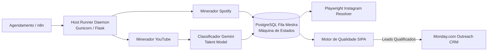

# BeatMatch AI Automation Hub

[](https://github.com/jraphaelcunha/beatmatch-ai-automation-hub)
[](https://github.com/jraphaelcunha/beatmatch-ai-automation-hub)
[](tests/)
[](pyproject.toml)
[](LICENSE)
[](src/models/schemas.py)

> **[ 🇺🇸 Read in English ](README.md)**

Pipeline autônomo de descoberta, qualificação e enriquecimento de talentos musicais projetado para produtores musicais, beatmakers e estúdios de áudio. Converte sinais sociais não estruturados em leads qualificados no Monday.com CRM para licenciamento de instrumentais e serviços de mixagem/masterização.

---

## Visão Geral

Produtores musicais e estúdios de engenharia de áudio gastam horas garimpando manualmente vocalistas e artistas independentes nas redes sociais, abordando com frequência artistas inalcançáveis ou contas inativas sem orçamento para gravação.

O BeatMatch AI automatiza esse fluxo de prospecção técnica:
1. **Ingestão Multi-Canal:** Minera menções e candidatos em comentários do YouTube e consultas à API do Spotify.
2. **Filtragem Semântica em Duas Etapas:** Aplica pré-filtro regex e classificação via Gemini 2.5 Flash para isolar vocalistas e letristas de produtores concorrentes e ouvintes passivos.
3. **Reconciliação de Identidade:** Mapeia menções sociais para IDs oficiais do Spotify via chaves determinísticas SHA-256 e restrições relacionais no PostgreSQL.
4. **Enriquecimento Social:** Localiza perfis verificados do Instagram via automação Playwright e captura métricas de streaming.
5. **Motor de Qualidade (SIPA):** Aplica regras de viabilidade comercial (<8.000 ouvintes mensais no Spotify, catálogo ativo e remoção de spam/duplicatas) antes de sincronizar os registros no CRM Monday.com.

Para detalhes completos de arquitetura e decisões de engenharia, consulte [docs/ARCHITECTURE.md](docs/ARCHITECTURE.md).

---

## Arquitetura do Sistema



---

## Guia de Início Rápido (Quickstart)

### 1. Pré-requisitos
* Python 3.11 ou 3.13
* PostgreSQL 14+ (ou instância Supabase)
* Git

### 2. Instalação
Clone o repositório e crie um ambiente virtual isolado:

```bash
git clone https://github.com/jraphaelcunha/beatmatch-ai-automation-hub.git
cd beatmatch-ai-automation-hub

python -m venv venv
# Linux / macOS:
source venv/bin/activate
# Windows:
.\venv\Scripts\Activate.ps1

pip install --upgrade pip
pip install -r requirements.txt -r requirements-dev.txt
```

### 3. Configuração de Variáveis de Ambiente
Copie `.env.example` para `.env` e configure suas credenciais:

```bash
cp .env.example .env
```

Principais variáveis:
* `DATABASE_URL`: String de conexão PostgreSQL (suporta connection pooler IPv4 do Supabase na porta 6543).
* `HOST_RUNNER_TOKEN`: Segredo obrigatório para autenticar chamadas ao runner daemon.
* `GEMINI_API_KEY`: Chave da API Google AI Studio (opcional em modo offline / fallback).
* `SPOTIFY_CLIENT_ID` / `SPOTIFY_CLIENT_SECRET`: Credenciais da API Spotify Developer.
* `MONDAY_API_TOKEN` / `MONDAY_BOARD_ID`: Credenciais de integração com a API GraphQL do Monday.com.

### 4. Inicialização do Banco de Dados
Crie as tabelas, índices e restrições de verificação:

```bash
python -m src.utils.db_setup
```

### 5. Execução dos Testes Locais e Verificação de Qualidade
```bash
# Executar os 59 testes unitários com relatório de cobertura
pytest tests/ -v --cov=src --cov-report=term-missing

# Linter estrito com Ruff
ruff check src/ tests/ eval/

# Análise estática de segurança com Bandit
bandit -r src/

# Auditoria de vulnerabilidades em dependências
pip-audit -r requirements.txt
```

### 6. Execução do Benchmark de LLM
```bash
# Modo simulado (sem consumo de cota de API)
python eval/evaluate.py --dataset eval/dataset_template.csv --mock

# Modo real (requer GEMINI_API_KEY)
python eval/evaluate.py --dataset eval/dataset_template.csv --output-markdown eval/REPORT.md
```

### 7. Inicialização do Host Runner Daemon
```bash
# Servidor de desenvolvimento:
python -m src.host_runner

# Servidor de produção (Gunicorn com 4 threads):
gunicorn --workers 1 --threads 4 --bind 127.0.0.1:5000 src.host_runner:app
```

---

## Uso Responsável de Dados e Conformidade com APIs

1. **Termos de Serviço de Plataformas:**
   * **YouTube Data API v3:** Ingestão respeita cotas diárias oficiais com paginação em lote.
   * **Spotify Web API:** Utiliza delays aleatórios (0.5s–1.0s) e tratamento de backoff exponencial em respostas HTTP 429.
2. **Privacidade de Dados (Alinhamento LGPD/GDPR):**
   * Coleta restrita a links e identificadores públicos publicados abertamente por criadores para promoção profissional.
   * `src.utils.gemini_classifier.sanitize_pii()` remove números de telefone e e-mails antes do envio para modelos externos.
3. **Ausência de Raspagem Invasiva:** Não são capturadas mensagens diretas fechadas ou dados sob paywall.

---

## Limitações e Próximos Passos

* **Execução Mononó:** O Host Runner isola grupos de processos (`killpg`) com confiabilidade, mas para cargas massivas distribuídas, recomenda-se transição para filas distribuídas (ex: Celery/Redis ou Kubernetes Jobs).
* **Resiliência do Playwright:** A resolução de Instagram depende de seletores DOM em páginas de busca. A inclusão de rotação de proxies aumentará a durabilidade sob volumes intensos de consultas.
* **Ciclo de Feedback Contínuo:** Falsos positivos identificados em produção pelo usuário devem alimentar o dataset em `eval/dataset_template.csv` para aprimorar futuros prompts.

---

## Como Este Repositório Foi Construído

Este projeto foi construído seguindo metodologia multiagente com governança de testes (TDD):
* **Separação de Papéis:** Agentes especializados de Segurança, Qualidade, Avaliação Quantitativa e Revisão Independente atuaram em branches isoladas com PRs rastreados.
* **Testes Antes da Correção:** Cada correção de vulnerabilidade ou qualidade foi acompanhada de um teste unitário comprovando a falha prévia.
* **Zero Flags Permissivas:** Proibição de `--exit-zero`, `--ignore` injustificados ou anotações `nosec` sem explicação na mesma linha.
* **Histórico Honesto:** Commits convencionais e datas reais de commit, documentadas em `docs/REVIEW-*.md`.

---

## Licença

Distribuído sob a licença MIT. Consulte [LICENSE](LICENSE) para mais informações.
