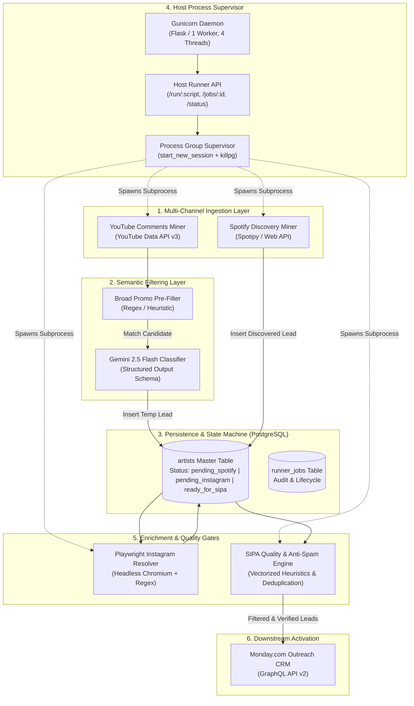
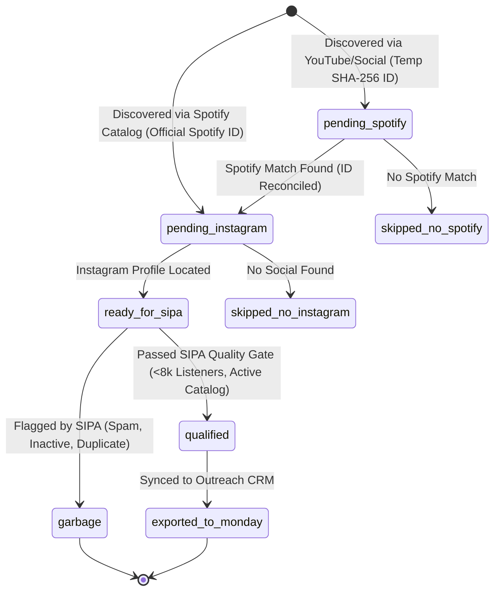

# System Architecture & Technical Design Decisions

This document details the engineering architecture, data pipelines, state machines, and technical design trade-offs governing `beatmatch-ai-automation-hub`.

---

## 1. System Topology & Data Flow

---

## 2. Reconciliation State Machine

Leads progress through a deterministic state machine managed in `src/reconciler.py`:

---

## 3. Key Architectural Decisions & Trade-Offs

### Decision 1: Lightweight Host Daemon (`Flask` + `subprocess` + `systemd`) vs. Distributed Queue (`Celery` / `RQ` + `Redis` / `RabbitMQ`)

* **Context:** The pipeline runs scheduled scraping, browser automation (Playwright), and enrichment jobs. The orchestration layer (n8n) runs inside Docker containers.
* **The Problem with Containerized Playwright / Heavy Scrapers:** Running Chromium and heavy data ingestion inside containerized n8n instances caused frequent out-of-memory (OOM) crashes on resource-constrained compute instances (e.g., 4GB RAM).
* **The Problem with Celery + Redis:** Introducing Celery requires maintaining an ephemeral message broker (Redis or RabbitMQ), a result backend, and multiple worker daemons. For a discrete pipeline running 4 to 6 scheduled tasks per day, this adds 300–500MB of resident idle memory and increases operational failure surfaces without business necessity.
* **Chosen Solution:** A native Python supervisor (`src/host_runner.py`) running under Linux `systemd` via Gunicorn.
* **Guarantees Delivered:**
  1. **Strict Process Group Isolation:** Subprocesses are spawned with `start_new_session=True` (`os.setsid`). If a job reaches its timeout threshold, `os.killpg(proc.pid, signal.SIGKILL)` terminates the entire process tree—guaranteeing no orphaned headless Chromium instances consume host memory.
  2. **Race-Condition-Free Slot Reservation:** Concurrent duplicate execution is prevented by an atomic mutex lock (`_active_lock`) that reserves the script slot before launching execution threads, returning HTTP 409 Conflict immediately on collision.
  3. **Persistent Audit Trail:** Job lifecycle events (UUID4, started_at, finished_at, exit_code, status) are persisted directly to PostgreSQL and inspectable via `GET /jobs/<job_id>`.

---

### Decision 2: Two-Tier Semantic Classification (Regex Pre-Filter -> Gemini LLM)

* **Context:** Social video comment sections contain massive volumes of spam, listener reactions, and producer promotions. Calling an LLM API on every raw comment is cost-prohibitive and introduces unnecessary latency.
* **Chosen Architecture:**
  1. **Tier 1 (Regex Pre-Filter):** `BROAD_PROMO_REGEX` screens raw text for music promotional keywords (`"my song"`, `"check my track"`, `"ouça meu som"`). Discards ~80% of non-promotional comments in sub-millisecond CPU time.
  2. **Tier 2 (Gemini 2.5 Flash Evaluation):** Candidates passing Tier 1 are evaluated by Gemini 2.5 Flash using structured JSON schema output (`TalentClassificationResult`). The prompt enforces strict distinction between performing artists (singers, vocalists, rappers) and producers/beatmakers.
* **Economic Impact:** Measured token consumption averages ~203 prompt tokens and ~28 output tokens per evaluated candidate, resulting in an estimated operational cost of **$0.0236 USD per 1,000 evaluated candidates** (based on official Gemini 2.5 Flash pricing: $0.075 / 1M input tokens, $0.30 / 1M output tokens).

---

### Decision 3: Strict Parameterized SQL via `psycopg2.sql` and Array Matching

* **Context:** Early iterations of queue filtering used string formatting (f-strings) to assemble SQL update queries and `IN (...)` clauses, introducing potential injection vectors and query plan bloat.
* **Chosen Architecture:**
  1. **Allowlist-Governed Dynamic Updates:** `src/reconciler.py` defines `ALLOWED_ARTIST_UPDATE_COLUMNS`. Any column key not present in the allowlist raises a validation failure and halts execution before touching the database driver. Queries are dynamically composed using `psycopg2.sql.Identifier` and `psycopg2.sql.SQL`.
  2. **Native Array Parameterization:** Batch operations in `src/quality/sipa_cleaner.py` use PostgreSQL's native array operator: `WHERE spotify_id = ANY(%s)`. This avoids runtime placeholder concatenation and allows the PostgreSQL query planner to optimize single-parameter array scans.

---

### Decision 4: Centralized Safe HTTP Client with Mandatory Timeouts and HTTPS

* **Context:** Dispersed integrations (`urllib`, `requests`) across different scraping scripts lacked unified timeouts and scheme validation, risking hanging sockets on dead connections.
* **Chosen Architecture:** `src/utils/http_client.py` centralizes all HTTP interactions.
  1. **Scheme Enforcement:** Rejects non-HTTPS schemes (`http://`, `ftp://`) with a `ValueError`.
  2. **Guaranteed Timeouts:** All calls enforce a default 15-second timeout.
  3. **API Normalization:** Monday.com GraphQL interactions (`query`, `variables`, error extraction) are unified in `call_monday_api()`, eliminating duplicated GraphQL request code.
